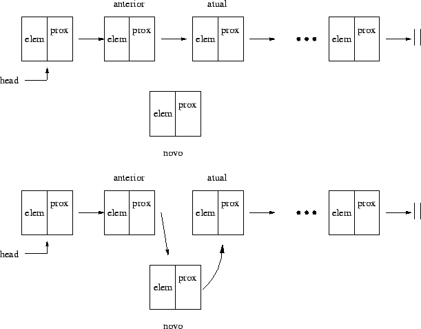

## Listas Simplesmente Encadeada

Em uma lista simplesmente encadeada, cada elemento possui a informação do endereço de quem é seu **sucessor**. É necessário também armazenar o endereço do **primeiro elemento** da lista. (*cabeça da lista ou início-lista*)

A quantidade total de memória utilizada pelos dados varia, ou seja, áreas de programa que não foram declaradas no programa passam a existir durante a sua execução. Os elementos consecutivos na lista não implicam em elementos consecutivos na representação (a ordem é lógica).

O esquema gráfico abaixo mostra o processo de inserção de um novo elemento em uma lista simplesmente encadeada. O novo elemento será inserido entre o elemento atual e o elemento anterior .

### As principais desvantagens das listas simplesmente encadeadas são:

* Impossibilidade de voltar ao elemento anterior
* Necessidade de guardar informação do elemento anterior a fim de realizar algumas operações.

##Referências

Prof. Eliane Xavier Cavalcanti, Estrutura de Dados – Parte IV, 2014